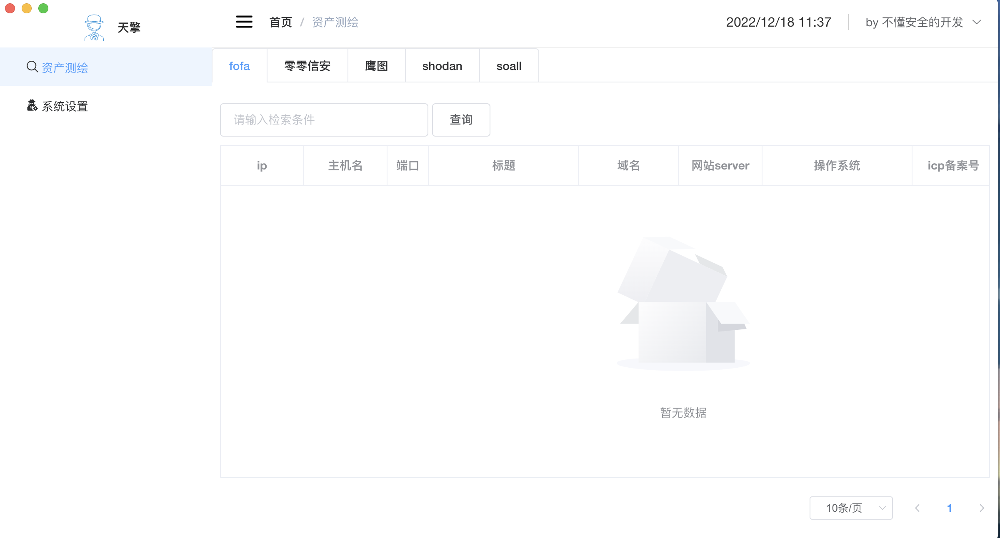
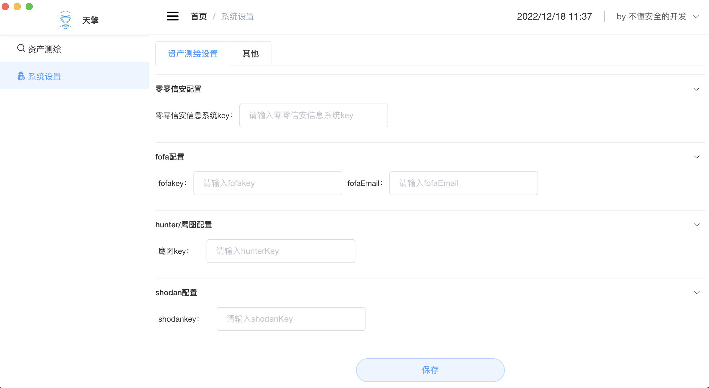
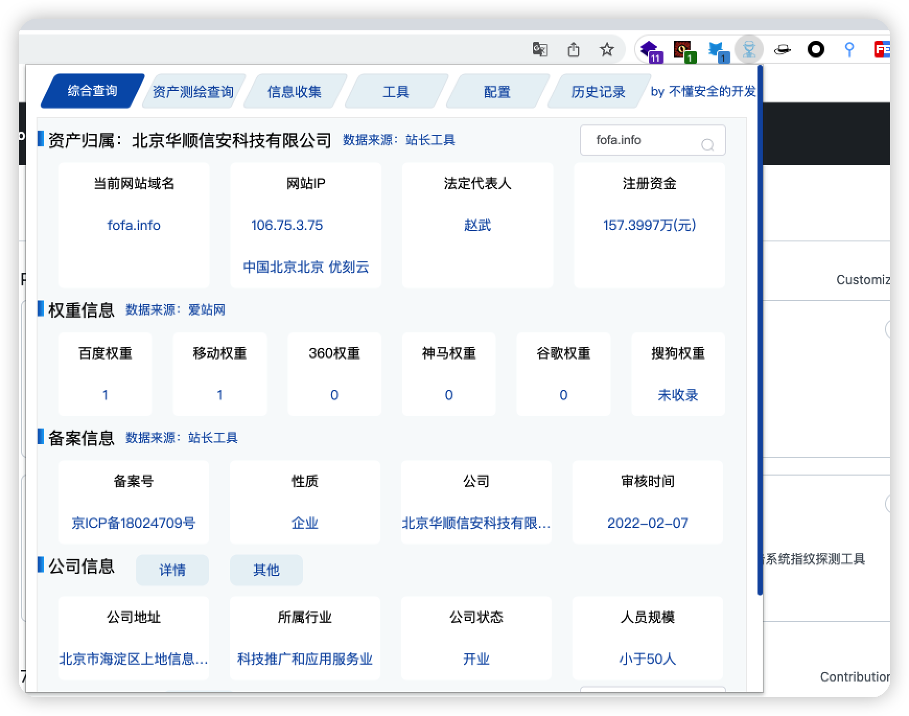

# superSearchPlus
跨平台空间资产测绘 如果觉得有用 一键三连啊 大佬们  
采用node.js + nwjs + vue.js  + elementui + jquery .... 
支持 谷歌浏览器插件版本、mac版本、win版本

## 谷歌浏览器版本下载
仓库地址：https://github.com/dark-kingA/superSearchPlus

## mac版本下载
地址： https://cowtransfer.com/s/83fe684300be4e 
## win版本下载
地址： https://cowtransfer.com/s/ad539b1d7c194c

## mac安装
解压包 将应用拖入应用程序即可

## win安装
解压包
双击superSearchPlus即可
